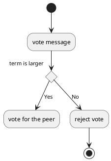

1. kv table & log
2. append
3. commit
4. recovery
5. leader & follower: term-lease
6. leader election: majority vote
7. election timer: randomization
8. backup
9. snapshot


# 流程图

leader选举：
```plantuml
Peer2 --> Peer3: term T: please vote for peer2, 
Peer2 --> Peer4: term T: please vote for peer2
Peer2 --> Peer5: term T: please vote for peer2

Peer5 --> Peer2: response vote for the peer2
Peer4 --> Peer2: response vote for the peer2
Peer3 --> Peer2: response vote for the peer2

Peer1 --> Peer1: vote for peer1(myself)
Peer2 --> Peer1: please vote for peer2

Peer1 --> Peer2: reject vote
Peer1 --> Peer2: term T+1: please vote for peer1 
Peer1 --> Peer3: term T+1: please vote for peer1
Peer1 --> Peer4: term T+1: please vote for peer1
Peer1 --> Peer5: term T+1: please vote for peer1
```


peer投票逻辑:



log同步：二阶段提交
```plantuml

Leader -> Peer1: ApplyMsg

Leader -> Peer2: ApplyMsg

Peer1 -> Leader: Response

Leader -> Leader: Commit

Leader -> Peer2: AppendLogEntry
 
```

leader续租
```plantuml
Leader -> Peer: new lease
Peer -> Peer: reset timeout clock
```


# 奔溃恢复机制

# 问题思考 considerations
1. 只有leader支持write, 那么如何提升QPS?
分而治之，在bucket/key粒度加锁，不同key的write不冲突，可以并发写入?

# raft课程实践

[实践指引](https://pdos.csail.mit.edu/6.824/labs/guidance.html)
[raft lab实现细节](https://pdos.csail.mit.edu/6.824/labs/lab-raft.html)


## part A: leader election
测试代码:
```shell
go test -run 2A
```

选举RPC接口：RequestVote
心跳RPC接口：AppendEntries
选举时，注意随机打散，避免总是投自己的票。
选举超时时间需要小心设置：它必须足够大，才能避免心跳超时；必须足够小，才能缩短不可用时间。


part B: log
part C: persistence
part D: log compaction

# 数据结构
参见[raft论文第5节](https://pdos.csail.mit.edu/6.824/papers/raft-extended.pdf)


## State 状态

**持久化状态--所有server**
(Updated on stable storage before responding to RPCs)
- currentTerm 本server观察到的最近期（首次启动时，初始化为0，后续单调递增）
- voteFor 本server收到的请求投票的候选人id
- log[] 日志项，每条数据包含状态机的一个命令，如果本server是leader的话，还有一个term字段。

**非持久化状态--所有server**
- commitIndex 本server观察到的已被提交（majority servers认可的）的最大log的索引位置
- lastApplied 本server观察到的最大log索引位置。

**非持久化状态--仅leader**
- nextIndex[]  由于server有快有慢，作为leader需要知道其他server需要的下一条log索引位置，才好发送(初始化为 leader 的最后log索引 + 1)。
- matchIndex[] 其他server成功复制的最后log索引位置。

## RequestVote RPC 请投我一票
Invoked by candidates to gather votes (§5.2).

入参
- term 候选人期号
- candidateId 候选人唯一id
- lastLogIndex 候选人最后一条log的索引位置
- lastLogTerm 候选人最后一条log的期号

返回
- term 当前期数，用于候选人更新自己的值
- voteGranted true表示候选人被投了一票

接收人实现逻辑：
1. 如果候选人term < 自己currentTerm，说明候选人term落后了，不适合当leader，返回false.
2. 如果voteFor 是null或候选人唯一id，并且候选人的log不落后于接收人 log，返回true投上一票。

## AppendEntries RPC 请添加日志项
用于leader将log复制到follower，或者用于心跳。

入参
- term leader的期号
- leaderId leader唯一id，方便follower重定向客户端请求到leader。
- prevLogIndex 上一条日志id
- prevLogTerm 上一条日志期号
- entries[] 日志列表，为了提高性能，可以一次发多条日志。对于心跳包则可以为空。
- leaderCommit leader已经确认提交的日志索引位置commitIndex

返回
- term 本机当前期号currentTerm, 用于leader更新自己的值。
- success 如果follower包含 prevLogIndex和prevLogTerm，则返回true。

接收者实现逻辑：
1. 返回 false: 若term < 本server当前期号currentTerm  (§5.1)
2. 返回 false: 若本server日志没有对应 prevLogIndex+prevLogTerm (§5.3)
3. 若本server已经存在的日志项与参数中新来的日志项冲突（相同index的term不同），说明这些是未被提交的日志项，删除此后的日志项解决冲突 (§5.3)
4. 将新日志项追加到本server（如已经有且一致则跳过）
5. 若leader已经确认提交的日志索引位置 leaderCommit > 本server的commitIndex, 则更新本server的commitIndex =
   min(leaderCommit, index of last new entry)

## server层面的逻辑

### 对所有Servers来说
- 若本server的 commitIndex > 本server的lastApplied: 递增lastApplied, 将 log[lastApplied]生效到上层KV状态机 (§5.3)

- 若RPC请求或响应包含的期号 T > 本server的当前期号currentTerm:
更新本server的当前期号currentTerm = T, 转变为【follower】角色 (§5.1)

### 对追随者来说Followers (§5.2):
- 响应leader和候选人的RPC

- 若选举超时，没收到当前leader发来的AppendEntries RPC请求 或者候选人发来的投票请求，则转变为【候选人】角色

### 对候选人来说Candidates (§5.2):
- 发起选举On conversion to candidate, start election:
  - 递增自己的期号 currentTerm
  - 给自己投一票: voteFor = 自己的id
  - 重置选举计时器（控制超时）
  - 向其他server发送 RequestVote RPC - "请投我一票"
- 如果收到多数server的选票，则转变为[leader]角色
- 如果收到AppendEntries请求，则转变为[follower]角色
- 如果选举计时器超时，则发起新一轮选举

### 对leader来说
- 选举时: 发送AppendEntries RPC（空的心跳包）给每个server; 空转时定期发送心跳包，延长自己的任期 (§5.2)
- 收到client的命令时: 将日志项添加到本地log, 并在日志项生效到KV状态机中的时候返回响应 (§5.3)
- 若对于follower的 last log index ≥ nextIndex: 把从nextIndex开始的日志项打包放AppendEntries RPC发送过去（解决换leader时的日志冲突）
  - 如果follower返回成功: 更新nextIndex[follower], nextIndex[matchIndex]  (§5.3)
  - 如果follower返回失败: 由于日志不一致导致 AppendEntries失败: nextIndex[follower]-- 然后重试 (§5.3)
- 更新提交索引位置 commitIndex = N (§5.3, §5.4)：若有一个值 N > commitIndex, 且多数的 matchIndex[i] ≥ N 且 log[N].term == currentTerm。


